## About Project Management System

This is a Laravel based project management system. 

## Features

- User Authentication
- Project Management
- Task Management
- Notification System

## Installation

1. Clone the repository
2. Run `composer install`
3. Run `npm install`
4. Run `npm run dev`
5. Run `php artisan migrate`
6. Run `php artisan db:seed`
7. Run `php artisan serve`

## Screenshots

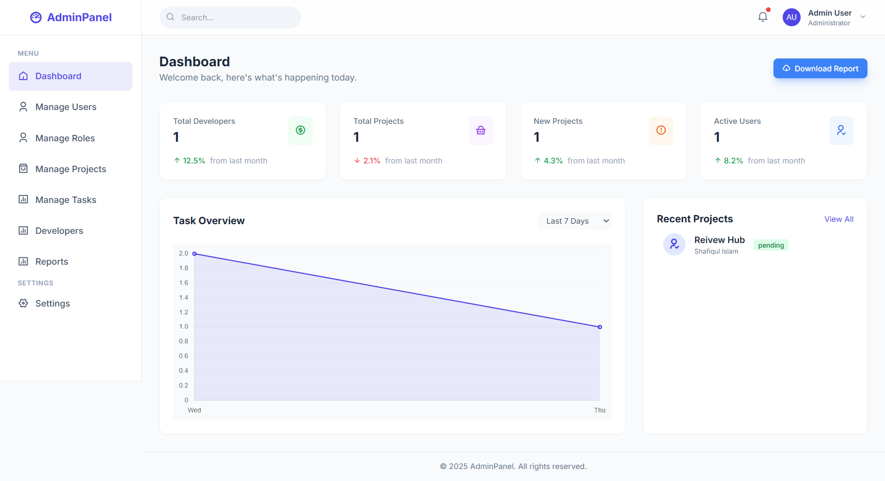
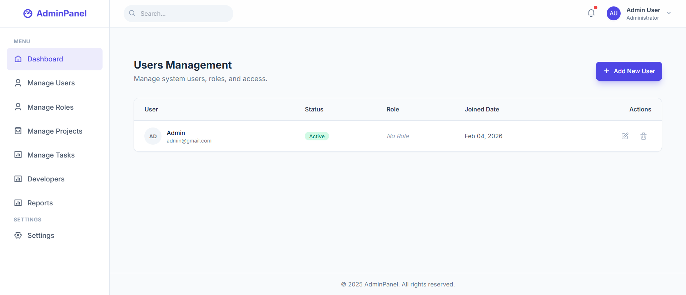
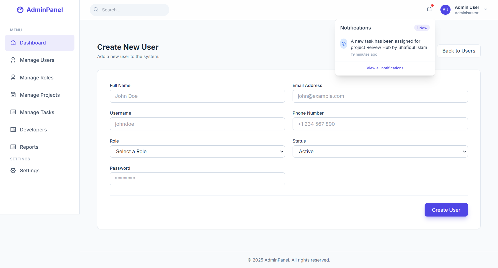
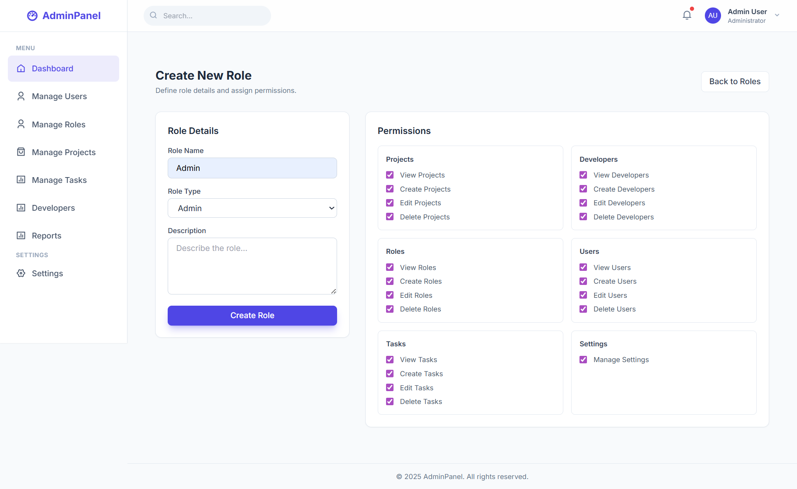
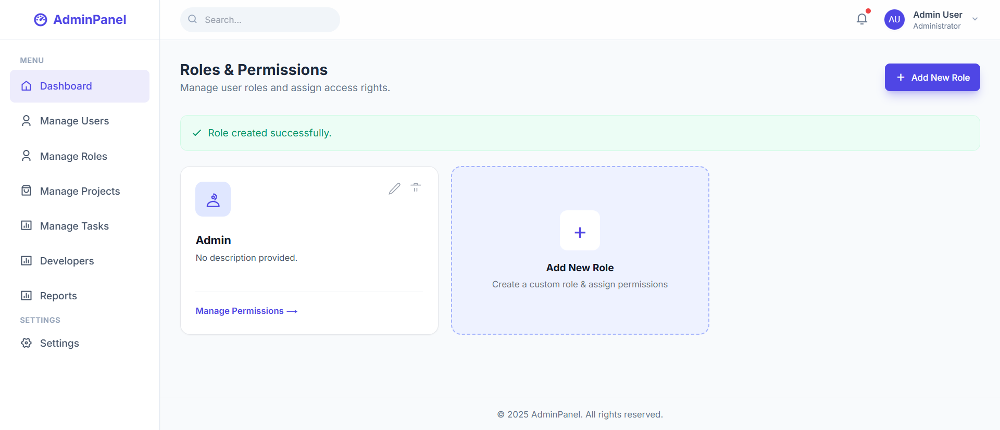
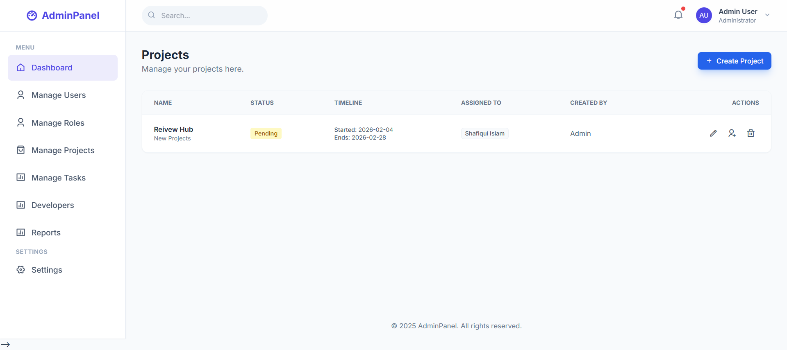
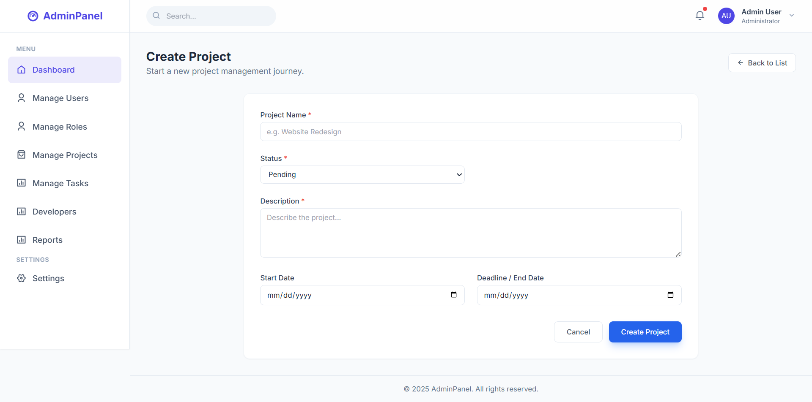
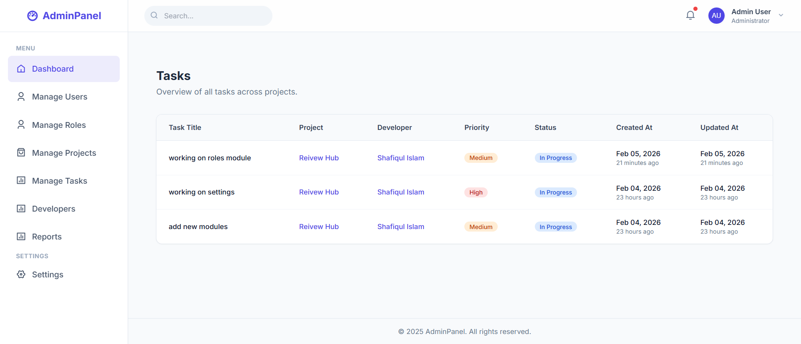
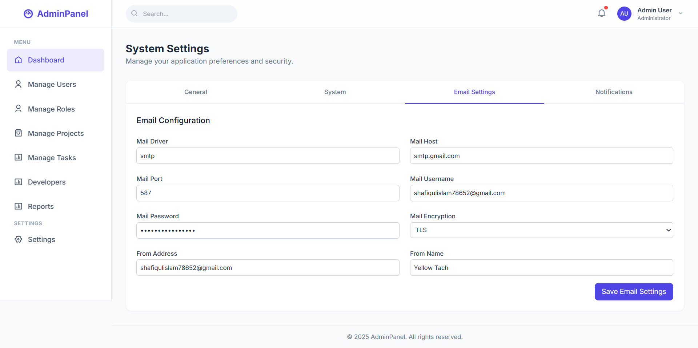
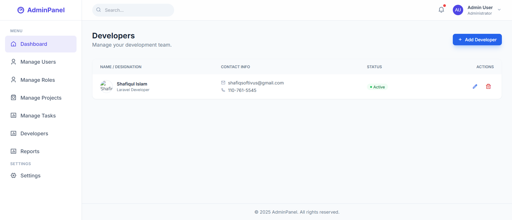
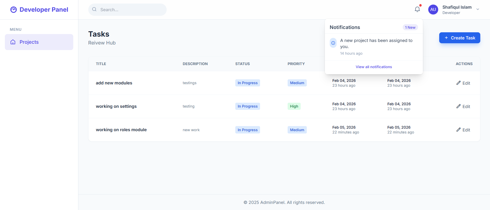
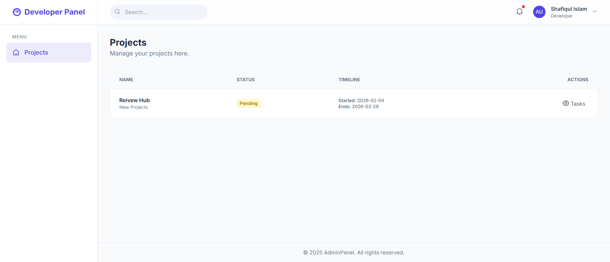

